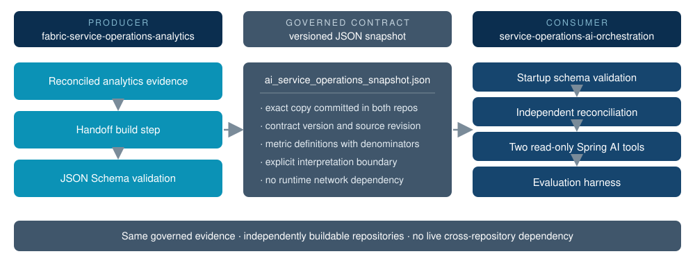
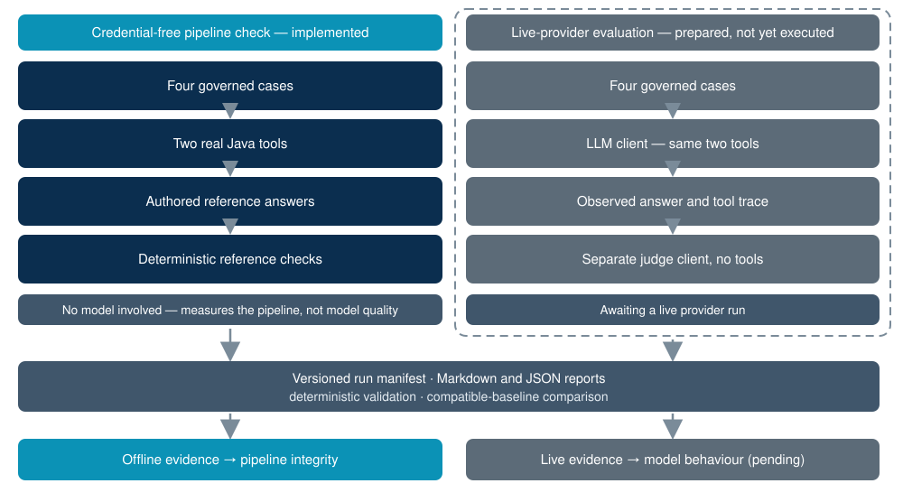

# Service Operations AI Orchestration

A Spring AI application that provides a governed analytics tool layer and a reproducible harness for evaluating whether an LLM preserves metric semantics and evidence boundaries.

> No live-provider evaluation has been executed or committed yet. The current evidence verifies the tool and evaluation pipeline with authored deterministic references; it does not measure model or prompt quality.

The application consumes the exact schema-validated handoff generated by [`fabric-service-operations-analytics`](https://github.com/DataTideHH/fabric-service-operations-analytics). Tool results expose contract and snapshot identities, upstream provenance, the reporting period, reconciled evidence, the comparison dimension, and an explicit interpretation boundary.

## Current capabilities

- exactly two read-only Spring AI tools over a pinned analytics snapshot
- Draft 2020-12 schema validation at startup
- independent reconciliation of overall and assigned-team counts and rates
- explicit denominator semantics and causal interpretation boundaries
- provider-configurable OpenAI and Anthropic evaluation runner
- captured tool traces and structured assessments
- versioned prompts and governed SHA-256 resource fingerprints
- Markdown and JSON reports with deterministic validation and regression comparison
- credential-free pipeline simulation kept separate from real model observations
- reproducible GitHub Actions build without provider credentials

## Governed tools

| Tool | Governed question |
| --- | --- |
| `get_overall_sla_performance` | Overall SLA attainment, breach rate, and operation counts |
| `compare_service_sla_performance` | Assigned-team comparison using the same governed SLA definition |

Both tools use SLA-eligible closed requests as their denominator. The assigned-team comparison is ordered by observed breach rate, but its boundary rejects causal explanations and an undefined use of “worst.”

## Pinned analytics handoff



The source snapshot is [`ai-service-operations-snapshot-v1.json`](src/main/resources/analytics/ai-service-operations-snapshot-v1.json), validated against the committed [`JSON Schema`](src/main/resources/contracts/ai-service-operations-snapshot-v1.schema.json). It is an exact copy of the producer artifact.

The tool contract is `2.0.0`, and the comparison dimension is explicitly `assigned_team`. Java independently derives rates from integer counts, reconciles team and overall totals, verifies unique groups and breach-rate ordering, and exposes the reviewed upstream fingerprints.

The pinned evidence contains 799 of 833 eligible closed requests within SLA. `network_ops` has the highest observed assigned-team breach rate at 6.98% (9 of 129). The snapshot supports this observation but not a causal explanation or general team-quality judgment.

## Deterministic verification

Requirement: Java 21+. The repository includes the Maven Wrapper.

```powershell
.\mvnw.cmd clean verify
```

Normal tests and CI do not call an LLM. They verify the schema, snapshot reconciliation, rate derivation, exact two-tool surface, contract metadata, provenance, ordering, and interpretation boundary.

## Credential-free pipeline check



The offline simulation executes all four cases through the real governed Java tools and produces Markdown and JSON artifacts with provider `offline-simulation` and model `deterministic-reference-v2`.

Its answers are authored references and its assessments are deterministic checks. This demonstrates tool execution, report generation, JSON validation, and comparison without claiming observed model behavior.

```powershell
$revision = git rev-parse HEAD
java -jar target/service-operations-ai-orchestration-0.4.0-SNAPSHOT.jar `
  --app.evaluation.artifact-command=simulate `
  --app.evaluation.source-revision=$revision `
  --app.evaluation.offline-run-at=2026-08-27T08:00:00Z `
  --app.evaluation.output-directory=evidence/offline-reference-v4
```

Validate and self-compare the generated baseline:

```powershell
java -jar target/service-operations-ai-orchestration-0.4.0-SNAPSHOT.jar `
  --app.evaluation.artifact-command=validate `
  --app.evaluation.artifact-report=evidence/offline-reference-v4/evaluation-report.json

java -jar target/service-operations-ai-orchestration-0.4.0-SNAPSHOT.jar `
  --app.evaluation.artifact-command=compare `
  --app.evaluation.artifact-baseline=evidence/offline-reference-v4/evaluation-report.json `
  --app.evaluation.artifact-report=evidence/offline-reference-v4/evaluation-report.json `
  --app.evaluation.output-directory=evidence/offline-reference-v4
```

Committed offline references live under [`evidence/offline-reference-v4/`](evidence/offline-reference-v4/). They are pipeline evidence, not LLM-quality evidence.

## Live-provider evaluation

No live-provider result is currently claimed. A live run requires separate API credentials; ordinary startup, tests, validation, comparison, and CI do not.

OpenAI example:

```powershell
$env:SPRING_AI_OPENAI_API_KEY="..."
java -jar target/service-operations-ai-orchestration-0.4.0-SNAPSHOT.jar `
  --app.evaluation.enabled=true `
  --app.evaluation.provider=openai `
  --app.evaluation.model=gpt-5-mini `
  --spring.ai.model.chat=openai `
  --spring.ai.openai.chat.options.model=gpt-5-mini
```

Anthropic uses `SPRING_AI_ANTHROPIC_API_KEY`, `--spring.ai.model.chat=anthropic`, and `--spring.ai.anthropic.chat.options.model=<model>`.

Each case receives an answer from a client with the two governed tools. A separate client without tools produces a structured automatic assessment. The runner writes `evidence/runs/evaluation-report.md` and `evidence/runs/evaluation-report.json`, validates the JSON artifact, and fails after writing the report if any case fails.

The manual GitHub workflow accepts `provider` and `model` inputs and requires the corresponding repository secret. Reports are uploaded as workflow artifacts and are never committed automatically. Reviewed model observations belong under [`evidence/runs/`](evidence/README.md), separate from offline references and normal CI.

## Reproducible evaluation artifacts

Every report records:

- schema and application versions
- provider, model, source revision, and execution time
- explicit prompt versions
- SHA-256 fingerprints for the analytics snapshot, its schema, the evaluation catalog, and all prompts
- all four answers, tool traces, and assessments

JSON reports can be validated without credentials:

```powershell
java -jar target/service-operations-ai-orchestration-0.4.0-SNAPSHOT.jar `
  --app.evaluation.artifact-command=validate `
  --app.evaluation.artifact-report=evidence/runs/evaluation-report.json
```

Compatible reports can be compared offline:

```powershell
java -jar target/service-operations-ai-orchestration-0.4.0-SNAPSHOT.jar `
  --app.evaluation.artifact-command=compare `
  --app.evaluation.artifact-baseline=evidence/runs/evaluation-baseline.json `
  --app.evaluation.artifact-report=evidence/runs/evaluation-report.json
```

Comparison fails closed when governed fingerprints differ or when a baseline pass becomes a candidate failure.

## Architecture decisions and history

The accepted decisions are documented under [`docs/decisions/`](docs/decisions/), including deterministic CI, model-dependent evaluation, versioned artifacts, separation of offline references, and the cross-repository snapshot handoff.

See [`CHANGELOG.md`](CHANGELOG.md) for the compact V1–V4 implementation history.

## Scope boundaries

Explicitly excluded: database access, ORM, JDBC, ML, a Python runtime in this repository, RAG, pgvector, Power BI, additional tools, a frontend, live analytics access, and causal claims.

## License

This project is licensed under the MIT License. See the [`LICENSE`](LICENSE) file for details.
